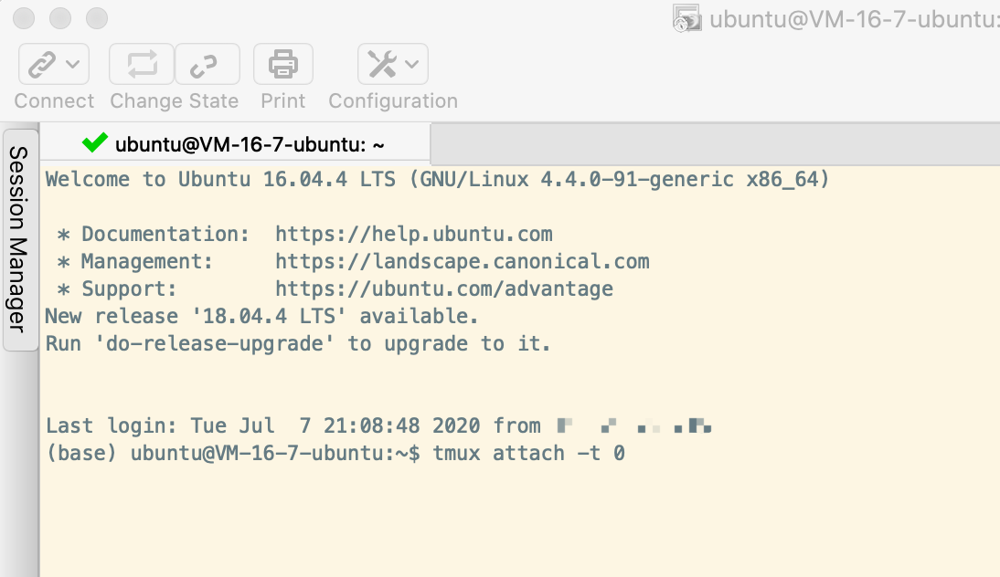
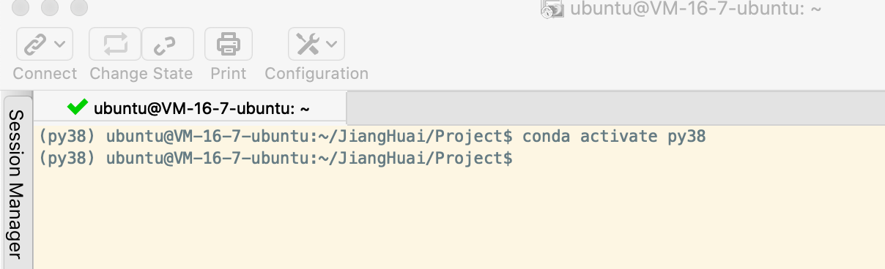
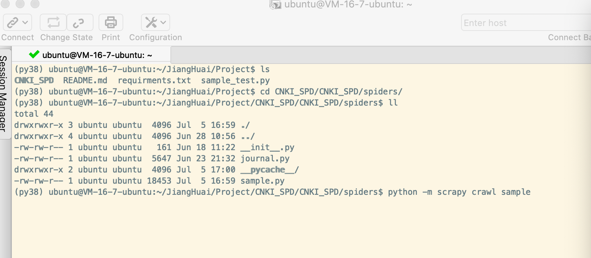
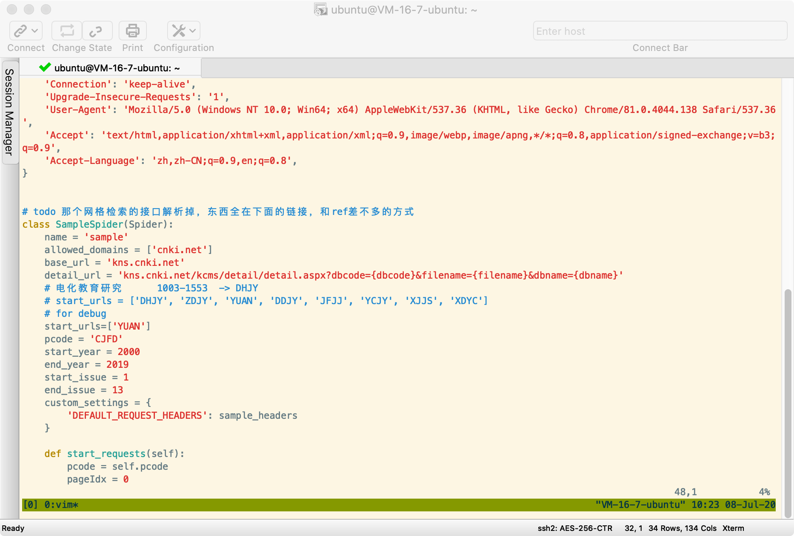

# CNKI_SPD

## 运行

0. 在服务器内新建一个 tmux 窗口`tmux`（服务器上已创建好）



1. 进入默认 tmux 窗口，`tmux attach -t 0`

2. 切换anaconda环境为python3.8 `conda activate py38`



3. 运行 python 脚本,目录位于`./CNKI_SPD/spiders`

运行期刊详情爬虫`python -m scrapy crawl sample`

运行期刊简介爬虫`python -m scrapy crawl journal`



4. 运行时可以暂时退出tmux，先按`CTRL+B`，再马上按`D`，将该窗口暂时收起。

## 参数设置

### 与爬虫设置有关的参数

settings.py 中设置数据库相关信息，

并发量：`CONCURRENT_REQUESTS`，本项目设置为 1，防止反爬和风控。

### 与爬取逻辑有关的参数

运行前确定`./CNKI_SPD/spiders/sample.py`中 SampleSpider：

```python
# 本次爬取的期刊编号，建议每次只运行1-2个期刊号，如注释
start_urls = ['DHJY', 'ZDJY', 'YUAN', 'DDJY', 'JFJJ', 'YCJY', 'XJJS', 'XDYC']
# start_urls=['DHJY','ZDJY']
pcode = 'CJFD'
# 设置开始年份
start_year = 2000
# 设置结束年份（不包括），如end_year设置2020，则爬取年份包括2000-2019的所有期刊
end_year = 2020
# 设置开始期刊号
start_issue = 1
# 设置结束期刊号（不包括），一般设置为13）
end_issue = 13
```

